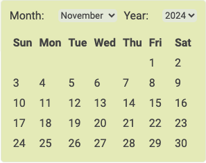

# Datepicker Component

The `Datepicker` component provides a simple interface for selecting a date from a calendar popup. It allows users to choose a date by clicking on a day within the calendar grid, and the selected date is displayed in an input field. The component includes month and year selection dropdowns, and it supports parent-child communication via the onChange function.

## Features

- **Date Selection**: Users can select a date from the calendar.
- **Month and Year Picker**: Allows for selecting the month and year, with a dropdown to navigate through months and years.
- **Customizable ID**: The component accepts an idPrefix to help with unique identification of input elements.
- **Parent Communication**: The selected date is passed back to the parent component via the onChange function.

## Installation

Ensure that the Datepicker.css file is imported for styling.
Import the `Datepicker` component into your project.

```jsx
import Datepicker from './src/component/Datepicker'
```

## Usage

```jsx
import { useState } from 'react'
import Datepicker from './Datepicker'

const MyComponent = () => {
  const [selectedDate, setSelectedDate] = useState('')

  const handleDateChange = (date) => {
    setSelectedDate(date)
  }

  return (
    <div>
      <h1>Selected Date: {selectedDate}</h1>
      <Datepicker idPrefix="date-input" onChange={handleDateChange} />
    </div>
  )
}
```

## Props

- **`idPrefix`** (string): The prefix for the ID of the date input field. This can be used to create unique IDs for multiple instances of the Datepicker component.
- **`onChange`** (function): A callback function that is called when a date is selected. It receives the selected date in DD/MM/YYYY format as an argument.

## Component Structure

- **Input Field**: An input field is used to display the selected date. The user cannot type in the field but can open the calendar popup by clicking on it.
- **Calendar Popup**: When the input field is clicked, a calendar is displayed where the user can select a date.
  Month and Year Selectors: Dropdowns are provided to allow the user to change the month and year.
- **Date Grid**: The calendar grid shows all the days in the selected month, and clicking a day selects the date.

## Example

```jsx
const DatepickerExample = () => {
  const [selectedDate, setSelectedDate] = useState('')

  const handleDateChange = (date) => {
    console.log('Selected date:', date)
    setSelectedDate(date)
  }

  return (
    <div>
      <h2>Choose a date:</h2>
      <Datepicker idPrefix="date-1" onChange={handleDateChange} />
      <p>Selected date: {selectedDate}</p>
    </div>
  )
}
```



## Customization

- **Styling**: Customize the calendar’s appearance by modifying the styles in Datepicker.css.
- **Date Format**: The selected date is returned in DD/MM/YYYY format. You can customize this format if needed by modifying the handleDayClick function.

## License

This component is open-source and can be freely used in any project.
